# MacRansom,Mac上的勒索软件分析（带过反调试、反虚拟机）

工具: [OSX/MacRansom:analyzing the latest ransomware to target macs](https://objective-see.com/blog/blog_0x1E.html)

作者: [kiba](https://github.com/ovekiba/)

2017.08 小组实验操作。成员：布兜儿，AloneMonkey，chensh，kiba， mAd mArk，初 见

--------


## 一、准备工作

由于是分析勒索软件，需要特别注意，在分析时自己的电脑不要中毒。可以执行附件中的[mac_ransom_guard.sh](./scripts/mac_ransom_guard.sh)脚本文件，来保护电脑。基本原理是每秒检查电脑中是否有本次分析的勒索软件释放出来的病毒文件，如果有就将该病毒文件改名，这样病毒程序就不能正常的启动了。

新开一个终端窗口，执行脚本。


同时也要关闭电脑中的杀毒软件。


## 二、下载样本

地址：https://objective-see.com/downloads/malware/macRansom.zip

密码：infect3d


## 三、分析软件的安装过程


### 1、启动lldb调试

新开一个终端窗口，以root权限启动lldb，并等待macRansom运行
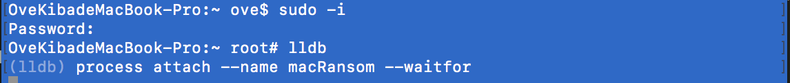


### 2、运行macRansom

第一运行时可能会提示运行失败
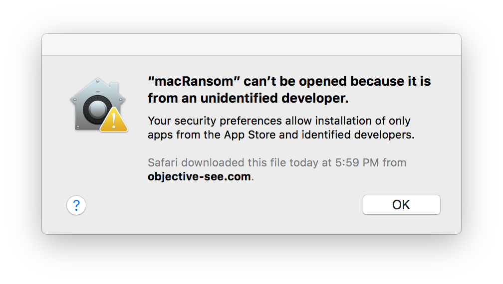

依次打开System Preferences... -> Security & Privacy -> General，点击图中的Open Anyway即可


### 3、绕过反调试

成功启动macRansom后，lldb的窗口会出现
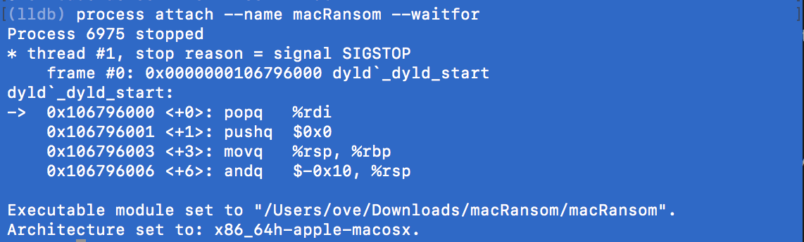


#### a、绕过ptrace

软件使用函数ptrace给自己设置PT_DENY_ATTACH标志防止自己被调试，一旦设置上了该标志，就无法继续调试软件了。解决方法是不让软件设置上该标志。
具体步骤：

> * 在ptrace函数上设置断点

> * 当程序执行该函数时，直接返回，而不执行ptrace中的代码

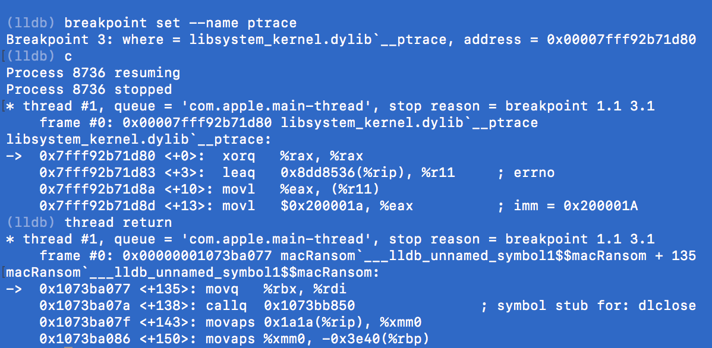


#### b、跳过虚拟机检查

软件为避免被调试分析，还做了两次虚拟机运行检查，一旦检查到是在虚拟机中运行，就会退出程序。

软件使用system函数执行命令，在system上下断点即可。

第一次是使用命令
```bash
sysctl hw.model|grep Mac > /dev/null
```
检查运行系统的硬件模型是不是mac，如果不是就判定为虚拟机。

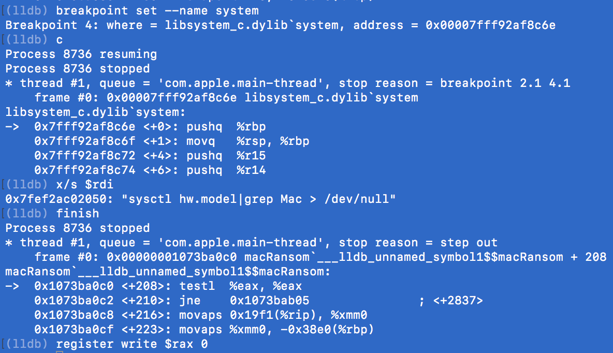


第二次是使用命令
```base
echo $((`sysctl -n hw.logicalcpu`/`sysctl -n hw.physicalcpu`))|grep 2 > /dev/null
```
检查运行系统的硬件的逻辑CPU个数是不是物理CPU个数的2倍，如果不是就判定为虚拟机。

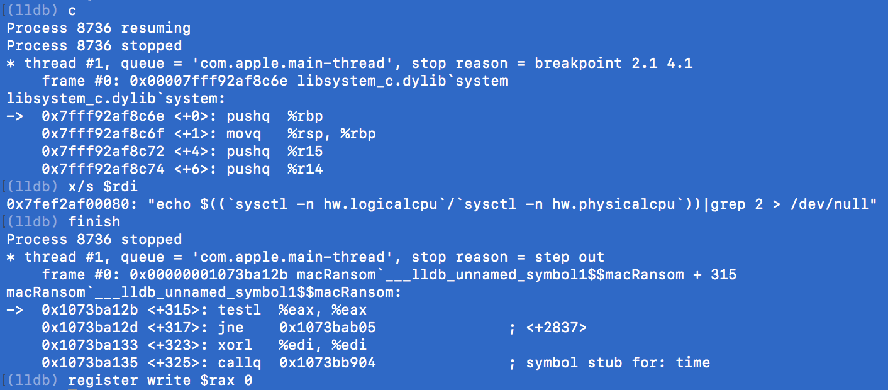


### 4、分析逻辑

保持system断点有效不变。依次执行命令，即可看到主要的逻辑。

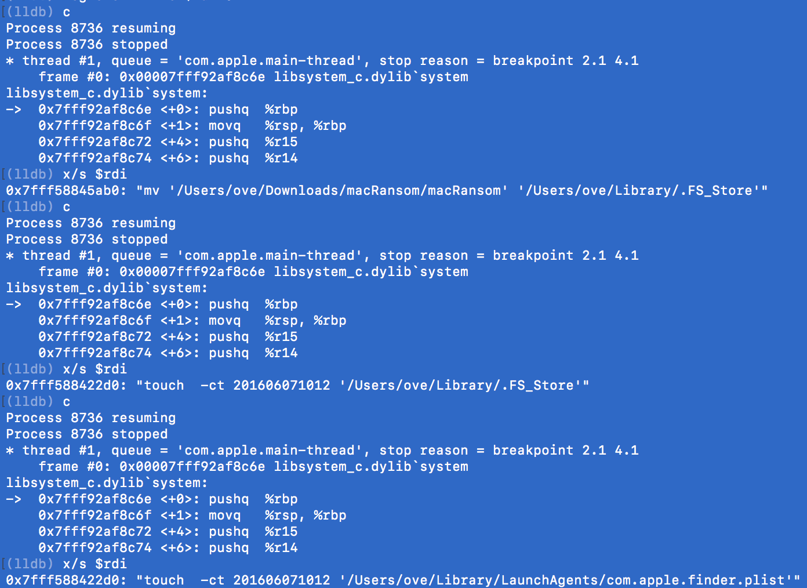
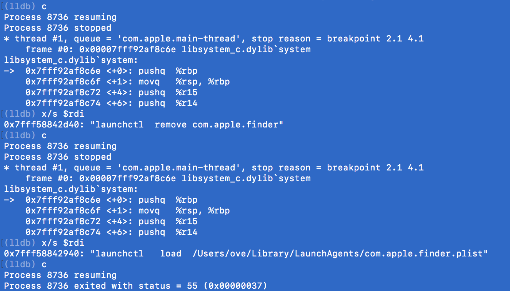

> * 把软件自己移动到~/Library/.FS_Store
> * 设置文件~/Library/.FS_Store的创建和修改日期为2016年6月7日10点12分
> * 创建文件~/Library/LaunchAgents/com.apple.finder.plist
> * 设置文件~/Library/LaunchAgents/com.apple.finder.plist的创建和修改日期为2016年6月7日10点12分
> * 删除系统中名为com.apple.finder的服务
> * 以配置文件~/Library/LaunchAgents/com.apple.finder.plist启动名为com.apple.finder的服务
> * 退出程序

其中~/Library/LaunchAgents/com.apple.finder.plist文件的内容如下：
```text
    <plist version="1.0">
    <dict>
    <key>Label</key>
    <string>com.apple.finder</string>
    <key>StartInterval</key>
    <integer>120</integer>
    <key>RunAtLoad</key>
    <true/>
    <key>ProgramArguments</key>
    <array>
    <string>bash</string>
    <string>-c</string>
    <string>! pgrep -x .FS_Store && ~/Library/.FS_Store</string>
    </array>
    </dict>
    </plist>
```

当名为com.apple.finder服务启动后，RunAtLoad为true表明当用户登陆系统后，软件会自动运行。运行的命令为：

```bash
bash -c ! pgrep -x .FS_Store && ~/Library/.FS_Store
```

如果软件.FS_Store未运行就启动软件，否则不运行。


至此，软件完成了安装到系统中，并当用户登陆系统时自动运行的功能。


## 四、分析软件的加密过程

> 注意：因为运行了守护脚本[mac_ransom_guard.sh](./scripts/mac_ransom_guard.sh)，所以文件~/Library/.FS_Store被改名为了~/Library/.FS_Store.bk，进行此步骤时必须关闭守护脚本。

软件其实会检测文件~/Library/.FS_Store和文件~/Library/LaunchAgents/com.apple.finder.plist是否存在，如果存在就会直接开始加密文件。所以我们可以创建假的文件来欺骗软件。

```bash
touch ~/Library/.FS_Store
touch ~/Library/LaunchAgents/com.apple.finder.plist
```

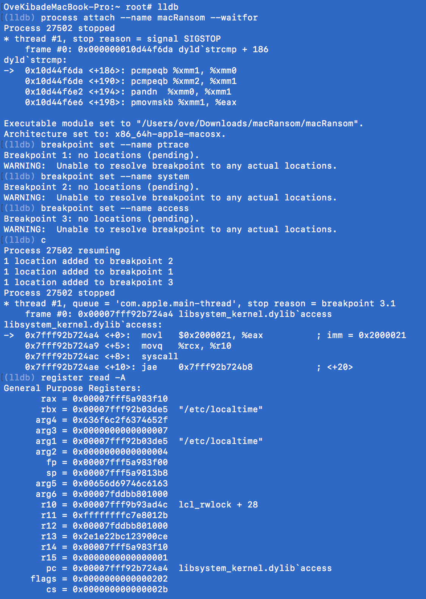
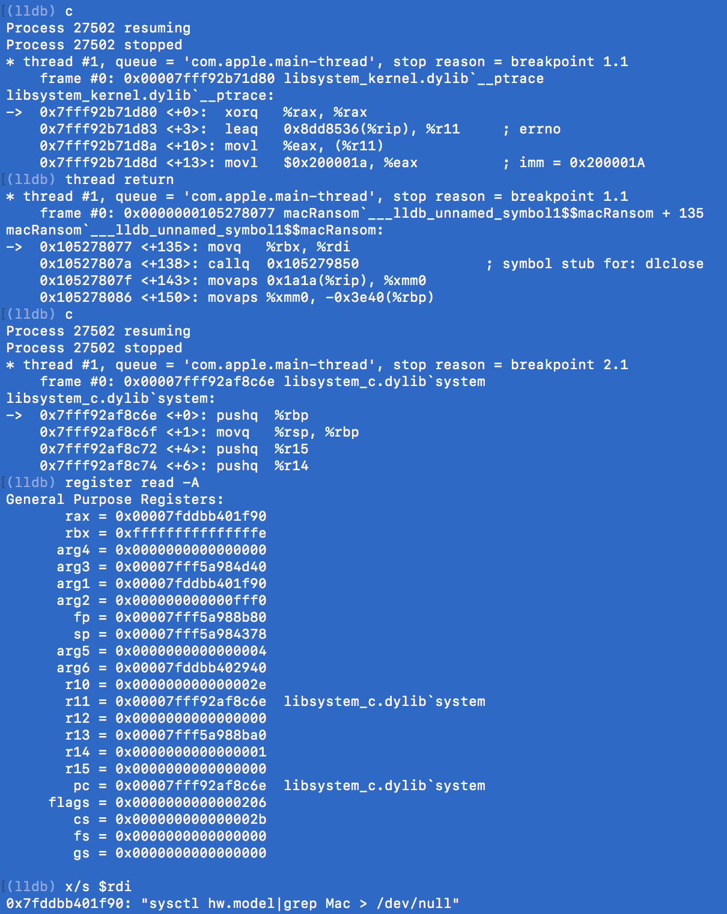
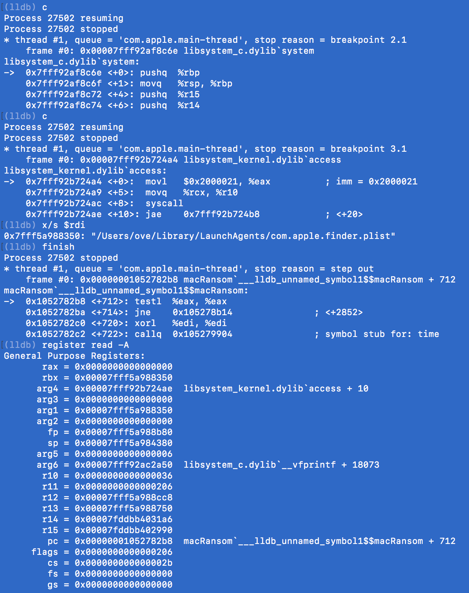
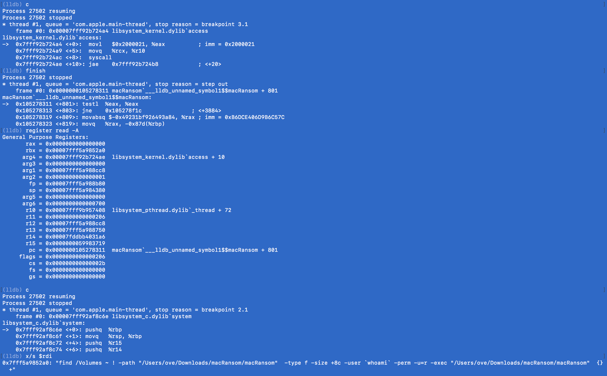

最后，软件会调用命令：
```bash
find /Volumes ~ ! -path "/Users/ove/Downloads/macRansom/macRansom"  -type f -size +8c -user `whoami` -perm -u=r -exec "/Users/ove/Downloads/macRansom/macRansom"  {}  +
```
来查找整个电脑中，除去文件/Users/ove/Downloads/macRansom/macRansom的所有其他普通文件，文件大小大于8个字符，属于当前用户的，有可读权限的文件，并将这些文件加密。
