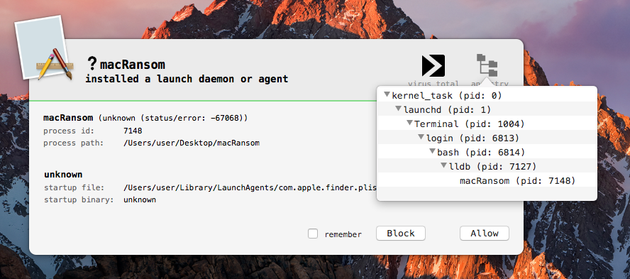
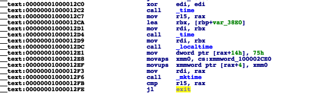
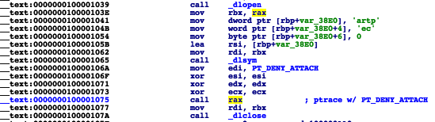
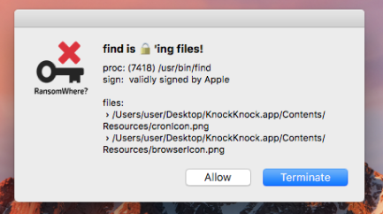

##OSX/MacRansom

**原文链接：** [OSX/MacRansom](https://objective-see.com/blog/blog_0x1E.html)

**翻译：**  初 见　　**校对：**  布兜儿


###分析最近Mac上的勒索软件

6/12/2017

想一起玩吗？我共享了恶意软件的二进制可执行文件(“macRansom”)，可以在[这里](https://objective-see.com/downloads/malware/macRansom.zip)下载 (密码:``infect3d`` )。

**请不要感染你自己的 Mac**

####背景

周一快乐!今天我们有一些新的关于 MacOS 勒索软件的博客记录：）

由Fortinet公司的研究人员发现，Rommel Joven（[@rommeljoven17](https://twitter.com/rommeljoven17)）和Wayne Chin Yick Low（[@x9090](https://twitter.com/x9090)）发布的标题为["MacRansom最初的恶意软件：提供的勒索软件作为服务"](https://blog.fortinet.com/2017/06/09/macransom-offered-as-ransomware-as-a-service)的文章。请阅读后再来这里！

现在,我应该在白皮书上为我的[VirusBulletin 2017 talk](https://www.virusbulletin.com/conference/vb2017/abstracts/offensive-malware-analysis-dissecting-osxfruitfly-custom-cc-server/) 写点东西，好的，开门见山，时间是宝贵的。

#### 分析

OSX / MacRansom 是一款相当差劲的勒索软件。从技术角度来看，它并不是特别先进。有趣的是,它的目标是 macOS，并“作为一项服务”来提供。老实说我不是100%肯定，后者意味着什么——但 Fortinet 提到了一个基于 TOR 的门户网站，并通过电子邮件与作者联系,以便定制恶意软件。我猜这是恶意软件作者提供的服务？

不管怎样，来点技术细节吧！当恶意软件运行时（正如Fortinet的文章指出的），它进行各种反调试和反虚拟机检查。这些都是运行的基本，以及微不足道的：

+ 反调试检查发生在`0000000 100001075`地址处。这是通过调用带有 `pt_deny_attach` 标识的 ptrace 完成的。

这个反调试逻辑是众所周知的（我们上次讨论过的[博客](https://objective-see.com/blog/blog_0x1F.html)），甚至在苹果的ptrace手册页中也有记录：

```
man ptrace

PTRACE(2)
NAME
ptrace -- process tracing and debugging

... 


PT_DENY_ATTACH
 This request is the other operation used by the traced process; it allows a process that
 is not currently being traced to deny future traces by its parent. All other arguments
 are ignored. If the process is currently being traced, it will exit with the exit status
 of ENOTSUP; otherwise, it sets a flag that denies future traces. An attempt by the parent
 to trace a process which has set this flag will result in a segmentation violation in
 the parent.
```

简而言之,`PT_DENY_ATTACH(0x1f)` 一旦执行，就会阻止用户模式调试器附加到进程。但是，由于LLDB已经被附加到该进程(感谢——waitfor的论点)，我们可以巧妙地避开这个问题。怎么做?在 pthread 上设置一个断点，然后简单地执行一个 `thread return` 命令。

这是在告知调试器停止执行函数中的代码,并执行一个返回命令“退出”到调用者。 Neat!

```
* thread #1, queue = 'com.apple.main-thread', stop reason = breakpoint 1.1
frame #0: 0x00007fffad499d80 libsystem_kernel.dylib`__ptrace


(lldb) thread return
```

通过反调试逻辑的方式，我们可以调试我们想要的内容！

+ 第一个反虚拟机检查发生在`0x00000001000010BB`。

解码字符串（字符串解码程序：`0x0000000100001f30`）之后，代码通过系统调用来执行它，如果返回非零的值，则退出。具体来说，它执行的是`sysctl HW.model|grep MAC > /dev/null` '：

```
(lldb) x/s $rdi
0x100200060: "sysctl hw.model|grep Mac > /dev/null"

(lldb) n
Process 7148 stopped
* thread #1, queue = 'com.apple.main-thread', stop reason = instruction step over

frame #0: 0x00000001000010bb macRansom`___lldb_unnamed_symbol1$$macRansom
  -> 0x1000010bb <+203>: callq 0x1000028fe ; symbol stub for: system
  0x1000010c0 <+208>: testl %eax, %eax
  0x1000010c2 <+210>: jne 0x100001b05 ; <+2837>
  0x1000010c8 <+216>: movaps 0x19f1(%rip), %xmm0
```

在虚拟机（VM）中将返回一个非零值，因为 hw.model 的返回值将会类似于 “vmware7,1”：

在本机硬件上：

```
$ sysctl hw.model
hw.model: MacBookAir7,2
```

在虚拟机上（例如：在 VM 上）

```
$ sysctl hw.model
hw.model: VMware7,1
```

为了绕过这个检查（在调试器中），需要掉托系统调用的步骤，然后将 RAX 设置为零：

```
(lldb) reg write $rax 0

(lldb) reg read
General Purpose Registers:
  rax = 0x0000000000000000
  rbx = 0xfffffffffffffffe
  rcx = 0x0000010000000100
```

这将欺骗恶意软件继续执行，而不是退出。

+ 接下来的反虚拟机检查发生在`0x0000000100001126`。同样，恶意软件解码一个字符串，通过系统调用执行它，如果返回值不是零，则退出。这个检查执行：` echo $((sysctl -n hw.logicalcpu`/`sysctl -n hw.physicalcpu))|grep 2 > /dev/null` 来查看 CPU 数。看起来在 VM 上，这个值不是两个，所以恶意软件将退出以“逃避”分析。在本机硬件上：

```
$ sysctl -n hw.logicalcpu
4
$ sysctl -n hw.physicalcpu
2
```

在虚拟机上（例如：在 VM 上）

```
$ sysctl -n hw.logicalcpu
2
$ sysctl -n hw.physicalcpu
2
```

同样，如果恶意软件正在执行的系统没有两个CPU（默认VM可能不会），恶意软件将退出。要（在调试器中）绕过这个检查，只需要再次跳过系统调用，然后将RAX设置为零。


好的，以上就是反分析检查。虽然我们在调试器中动态地绕过了它们，但也可以通过 patch 永久性地解决。例如，可以简单地 patch JNZ 指令（用 NOP 核对反虚拟机检查的返回值）。


假设所有的反分析都已通过或被阻止，之后，恶意软件会将自身作为一个启动代理。做到这一点通过:

1. 将自身复制到 ` ~/Library/.FS_Store`

2. 解码一个嵌入的 plist 并写入  `~/Library/LaunchAgents/com.apple.finder.plist`:

 ```
   cat ~/Library/LaunchAgents/com.apple.finder.plist

   <plist version="1.0">
   <dict>
     <key>Label</key>
     <string>com.apple.finder</string>
     <key>StartInterval</key>
     <integer>120</integer>
     <key>RunAtLoad</key>
     <true/>
     <key>ProgramArguments</key>
     <array>
       <string>bash</string>
       <string>-c</string>
       <string>! pgrep -x .FS_Store && ~/Library/.FS_Store</string>
     </array>
   </dict>
   </plist>

 ```

将 `RunAtLoad` 键值设置为 `true`  那么当用户登录时恶意软件将自动启动。具体来说，操作系统将执行键值为 `ProgramArguments` 设置的值: `bash -c ! pgrep -x .FS_Store && ~/Library/.FS_Store`。这个命令将首先检查以确保恶意软件尚未运行,然后启动恶意软件 ` (~/Library/.FS_Store)`。

幸运的 Objective-See 使用者们， [BlockBlock](https://objective-see.com/products/blockblock.html) 将会提醒你这个持续性的尝试：




由于恶意软件第一次尝试驻留是在密文件之前，所以点击警报上的 `Block`， BlockBlock 将阻止恶意软件做任何伤害:)

为了便于分析，如果我们允许恶意软件的驻留，它通过以下方式启动它刚刚保存的自身的副本 `(~/Library/.FS_Store)`：

`launchctl load ~/Library/LaunchAgents/com.apple.finder.plist`:

```
Process 7148 stopped
* thread #1, queue = 'com.apple.main-thread', stop reason = instruction step over

frame #0: 0x0000000100001ec6 macRansom`___lldb_unnamed_symbol1$$macRansom + 3798
  -> 0x100001ec6 <+3798>: callq 0x1000028fe ; symbol stub for: system
  0x100001ecb <+3803>: movb $0x25, -0x4733(%rbp)
  0x100001ed2 <+3810>: movb $0x73, -0x4732(%rbp)
  0x100001ed9 <+3817>: movb $0x0, -0x4731(%rbp)

(lldb) x/s $rdi
0x7fff5fbfb960: "launchctl load /Users/user/Library/LaunchAgents/com.apple.finder.plist"
```

该恶意软件的原始实例将退出，因为副本正在运行。

要通过调试恶意软件的持续性副本来继续分析，请在辅助调试器窗口中执行以下操作，在恶意软件的原始实例启动持久性副本（〜/ Library / .FS_Store）之前：

```
$ sudo lldb (lldb) process attach --name .FS_Store --waitfor
```

这将导致调试器在启动时，自动附加到恶意软件的持续性副本：

```
$ sudo lldb (lldb) process attach --name .FS_Store --waitfor

Process 7280 stopped
* thread #1, stop reason = signal SIGSTOP

frame #0: 0x000000011140e000 dyld`_dyld_start
  -> 0x11140e000 <+0>: popq %rdi
  0x11140e001 <+1>: pushq $0x0
  0x11140e003 <+3>: movq %rsp, %rbp
  0x11140e006 <+6>: andq $-0x10, %rsp

Executable module set to "/Users/user/Library/.FS_Store".
Architecture set to: x86_64h-apple-macosx.
```


由于恶意软件的持续性副本是拷贝的，所以它执行相同的反调试和反 VM 逻辑。然后，它将以持续状态运行，检查它是否触发了“触发”日期。也就是说，它将检查当前时间是否超过硬编码值。据Fortinet公司的报告，这是由恶意软件作者（“勒索软件作为服务的一部分”）设置的。如果当前时间是在这个日期之前，恶意软件将不会加密（赎金）任何文件，而将直接退出：



但是，如果触发了触发日期,则开始扫描！具体在地址`0x000000010b4eb5f5`处，恶意软件通过系统执行以下操作，开始加密用户的文件:

```
(lldb)
Process 7280 stopped
* thread #1, queue = 'com.apple.main-thread', stop reason = instruction step over

frame #0: 0x000000010b4eb5f5 .FS_Store`___lldb_unnamed_symbol1$$.FS_Store + 1541
  -> 0x10b4eb5f5 <+1541>: callq 0x10b4ec8fe ; symbol stub for: system
  0x10b4eb5fa <+1546>: movaps 0x151f(%rip), %xmm0
  0x10b4eb601 <+1553>: movaps %xmm0, -0x850(%rbp)
  0x10b4eb608 <+1560>: movb $0x0, -0x840(%rbp)

(lldb) x/s $rdi
0x7fff547123e0: "find /Volumes ~ ! -path "/Users/user/Library/.FS_Store" -type f -size +8c -user `whoami` -perm -u=r -exec "/Users/user/Library/.FS_Store" {} +"
```

这个命令是做什么的？

```
find /Volumes ~ ! -path "/Users/user/Library/.FS_Store" -type f -size +8c -user `whoami` -perm -u=r -exec "/Users/user/Library/.FS_Store" {} + 
```

首先，返回一个可读的、大于8字节的用户文件列表。然后这些文件将被传递给恶意软件的一个新实例，以便进行加密！我们可以通过一个实用工具来观察到这种加密，如 fs_usage：

```
access (_W__) /Users/user/Desktop/pleaseDontEncryptMe.txt
open F=50 (RW____) /Users/user/Desktop/pleaseDontEncryptMe.txt
WrData[AT1] D=0x018906a8 /Users/user/Desktop/pleaseDontEncryptMe.txt
```

该恶意软件的实际加密程序从地址 `0x0000000100002160` 处开始。通过 `pthread_create()` 间接调用这个函数：




正如 Fortinet 所指出的那样，加密不是基于RSA算法的，而是使用对称加密算法。不幸的是（对用户来说），虽然存在一个静态 Key `（0x39a622ddb50b49e9）`，但Joven和Chin Yick Low提到，对于每个文件，这个 Key 会被“随机生成的数字”重新排列。此外，这种随机排列不会被保存，也不会传给攻击者。因此，一旦加密，文件就几乎被消失了（除了暴力破解之外）。

好消息， [RansomWhere?](https://objective-see.com/products/ransomwhere.html) 一般可以检测并阻止这种攻击：




聪明的读者可能会奇怪为什么警告显示 “Find” 作为负责加的密过程（与恶意软件的.FS_Store）。原因是 `find` 先调用 fork() .然后调用 execvp() 来执行通过 `-exec` 选项指定的命令。RansomWhere？使用 macOS 的 OpenBSM 审计功能来跟踪进程创建——当这种审计生成 `fork()`、`exec()`和`execve()` 的进程事件时,它不支持（据我所知）`execvp()`。因此,当它检测到 `fork()` 进程事件(并且路径设置为 `/usr/bin/find` 时),之后的 `execvp()` 调用未经审计。因此路径保持为 `/usr/bin/find:/`

索要赎金的方法在哪里？重新查询操作系统后,每当它检测到一个加密文件的创建，就会提出。此时，进程（即 “find” ）将有`execvp()`，因此应返回正确的路径。或者苹果可以修复审计子系统:例如…我的意思是,这是一个审计旁路？我将提出一个雷达,……然后祈祷。

####结论

幸运的是，MacOS 上的恶意软件仍然是相当罕见的。然而，从技术角度来看，这是没有理由的。因为 Mac 被感染，以及写一段加密用户文件的代码都是很容易的。

虽然不太可能，但如果要检查如果你被感染了，请查找以下内容：

一个名为 `.FS_Store` 的进程 (running out of (~/Library)

一个plist文件：`~/Library/LaunchAgents/com.apple.finder.plist`

在这篇博文中，我们将拆解分析了 OSX / macransom - 一个基本的MacOS新勒索软件。幸运的是，有 BlockBlock 和 RansomWhere? 这样的防勒索软件，他们通常会检测勒索软件的持久性和加密。Kinda neat, huh? <3