# iOS Apps 打补丁及重签名实战操作笔记

**原文：** [Patching and Re-Signing iOS Apps](https://github.com/mail2chensh/OSG_Leaning/blob/master/Patching_and_ReSigning_iOS_Apps.md)

以下笔记内容是基于上面👆文章的实战操作。

<br>

## 准备工作

### 1. XCode

从 App Store 安装即可。

### 2. ipa 包及 Frida 动态库

* ipa 包：　　　　[UnCrackable_Level1.ipa](https://github.com/OWASP/owasp-mstg/blob/master/Crackmes/iOS/Level_01/UnCrackable_Level1.ipa)
* Frida 动态库：　[FridaGadget.dylib](https://build.frida.re/frida/ios/lib/FridaGadget.dylib)


### 3. mobileprovision 文件

**方法一**

拥有开发者账号的，可以直接登录苹果开发者官网，然后新建一个 App ID。

然后创建一个provisioning文件： **COM\_OSG\_UNCRACK.mobileprovision**

**方法二**

a.  打开XCode，新建一个 iOS 工程，在项目属性中，将 **General -> Signing -> Team** 设置为自己开发账号。

b. 在**真机**上运行后，找到项目 Products 下以.app结尾的包名，右键点击 `Show in Finder`，然后再在app文件上右键点击 `Show Package Contents`，弹出新窗口中则会出现 embedded.mobileprovision 文件，将此文件复制保存到其他文件夹，留以备用。

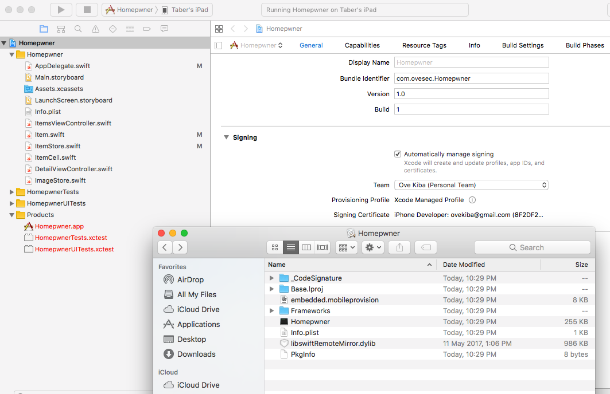


### 4. 下载并生成 optool 工具

[optool](https://github.com/alexzielenski/optool) : 修改 Mach-O 文件 Load Commands 中的 LC\_LOAD\_DYLIB 的工具，即修改文件的动态库链接。

在 Github 上面克隆 optool 的仓库，并更新子模块。

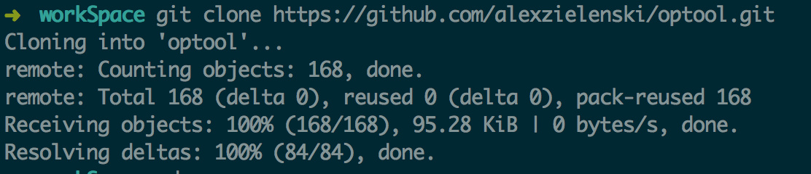

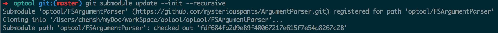

更新完毕后，用Xcode打开工程并运行。在工程目录的 `Products` 下，点击 optool 右键选择 `Show in Finder`，然后将 optool 文件拷贝到目录 `/usr/bin/` 下。

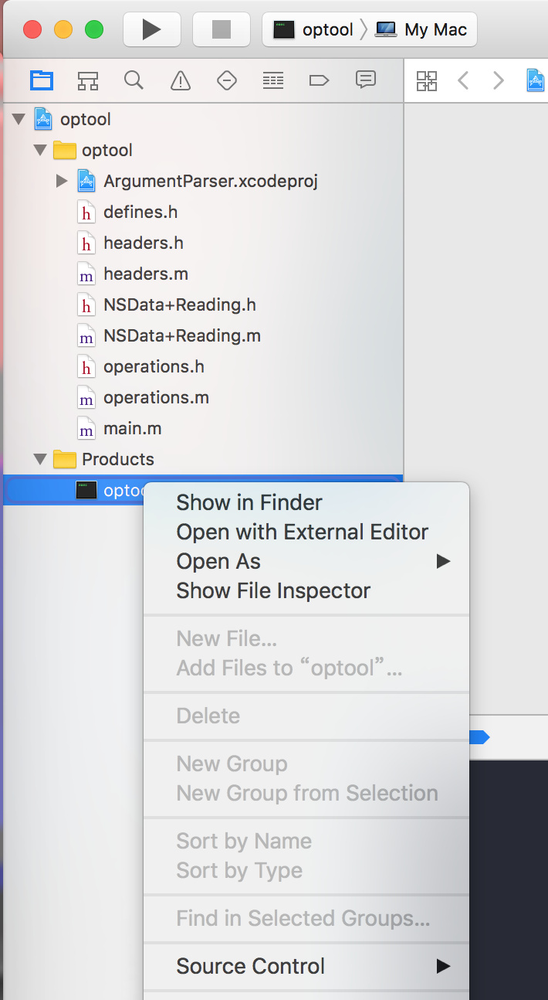


这样就可以直接使用 optool 命令了。

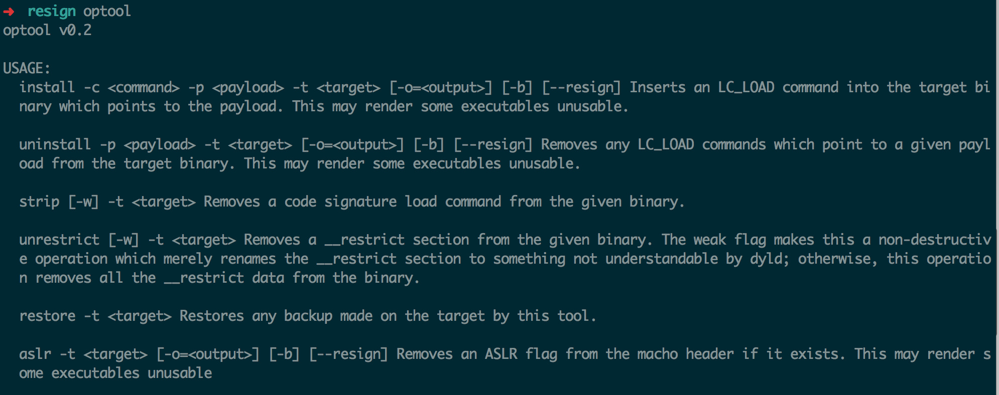


### 5. 安装 ios-deploy

```shell
npm install -g ios-deploy
```

### 6. 安装 Frida

```shell
sudo pip install frida
```

一切准备就绪，让我们磨刀霍霍吧~

<br>

## 开始

### 1. 解压 ipa 包

```shell
unzip UnCrackable_Level1.ipa
```

会在对应的文件目录下增加一个 Payload 文件夹，里面即是 app 包。


### 2. 拷贝动态库到 app 包

```shell
$ cp FridaGadget.dylib Payload/UnCrackable\ Level\ 1.app/
```

### 3. 使用 optool 添加链接路径

```shell
$ optool install -c load -p "@executable_path/FridaGadget.dylib" -t Payload/UnCrackable\ Level\ 1.app/UnCrackable\ Level\ 1
```

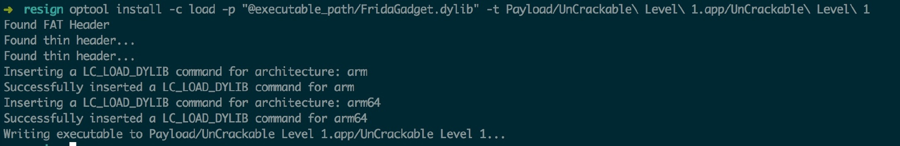

 `-c` 为指定 load_command 命令，`-p` 指定动态库的路径， `-t` 指定目标文件。


### 4. 拷贝 mobileprovision 文件，并改名为 embedded.mobileprovision

```shell
$ cp COM_OSG_UNCRACK.mobileprovision Payload/UnCrackable\ Level\ 1.app/embedded.mobileprovision
```
### 5. 得到 entitlements.plist 文件

```shell
$ security cms -D -i embedded.mobileprovision > profile.plist

$ /usr/libexec/PlistBuddy -x -c 'Print :Entitlements' profile.plist > entitlements.plist
```

最后得到的entitlements.plist文件内容与下面的内容相似：

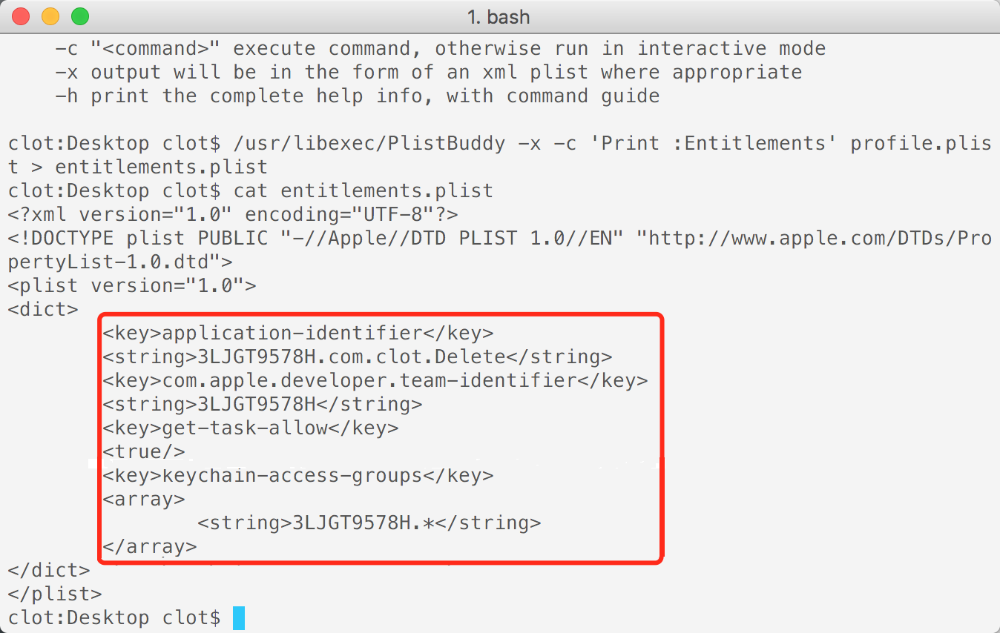

请注意，其中 **3LJGT9578H** 为 Team ID, **com.clot.Delete** 为 Bundle ID，请修改为实际操作中的对应的值。


### 6. 将 info.plist 中的 Bundle ID 更改为你自己的 ID

```shell
$ /usr/libexec/PlistBuddy -c "Set :CFBundleIdentifier com.clot.Delete" Payload/UnCrackable\ Level\ 1.app/Info.plist
```

<br>

### 7. 重签名

使用	`security` 命令查询本地钥匙串里面可用的证书。   
使用 `codesign` 命令进行签名。

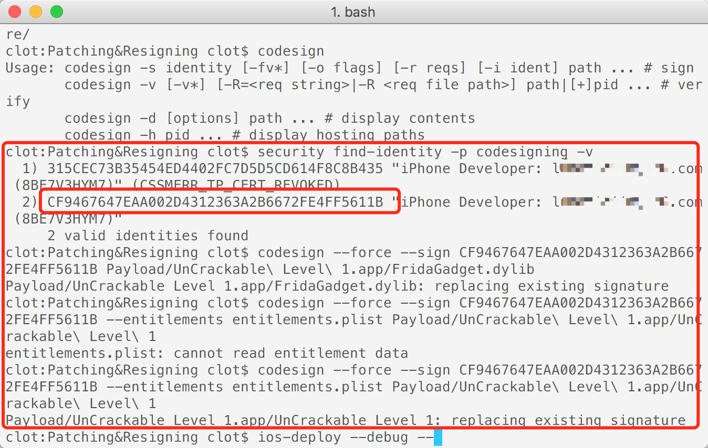


## 安装运行

到这里基本上打补丁和重签名就完成了，接下来可以使用 ios-deploy 这个工具来安装应用到手机，也可以直接重新压缩为 zip 格式并改为 ipa 后缀来安装。

```shell
$ ios-deploy --debug --bundle Payload/UnCrackable\ Level\ 1.app/
```

可以看到启动成功，并安装到手机上面，而且进入lldb的调试模式：

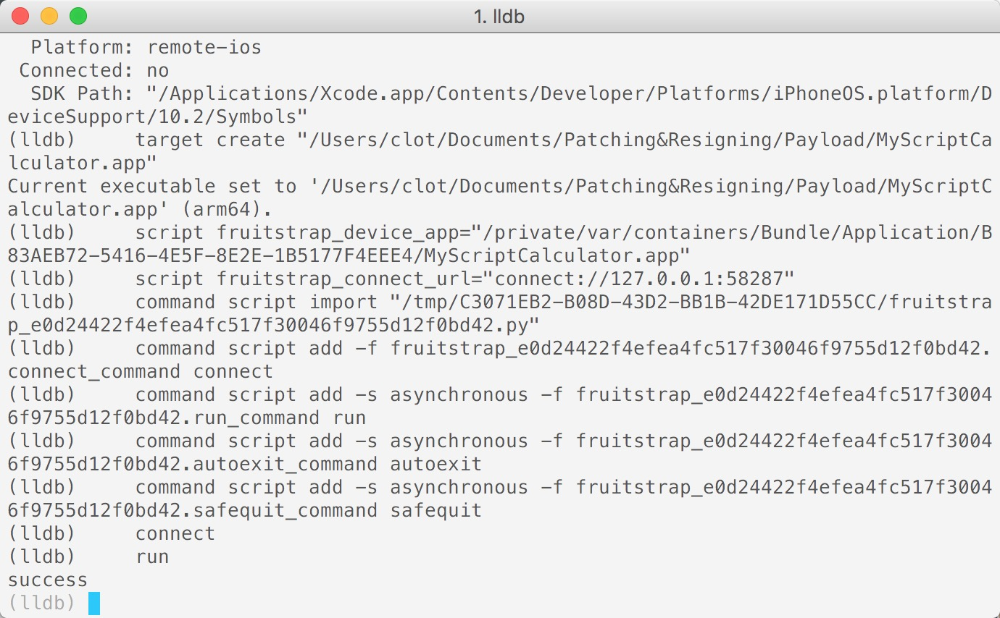


运行下面的命令：

```shell
$ frida-ps -U
```

可以看到对应的Server：

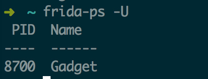

也就是说 frida 动态库也被加载起来了。


至此，我们的重签名步骤也全部完成了。✌️

<br>

## 注意事项

### 1. "SSL:CERTIFICAT\_VERIFY\_FAILED"

> 安装frida时，提示:    
> [SSL:CERTIFICAT\_VERIFY\_FAILED] certificates verify failed (_ssl.c:749)       
> 这可能是是因为下载软件安装包时，https的SSL证书验证失败。
> 
> **解决方法**：运行 python3 安装目录中的 Install Certificates.command 文件即可，该文件的路径在：   
> ```shell
> /Applications/Python 3.6/Install Certificates.command
> ```
> 
> 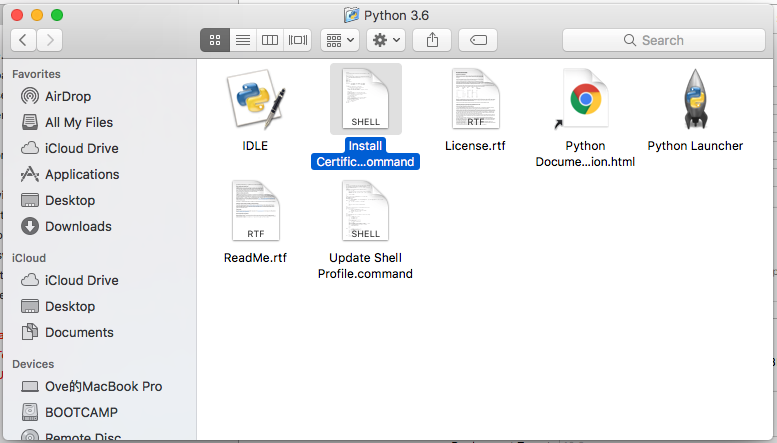 
> 


### 2. "main executable failed strict validation"

> 如果为 FridaGadget.dylib 签名命令的最后提示有"main executable failed strict validation"，说明签名失败，一个有可能的原因是文件未下载完整，需重新下载文件。

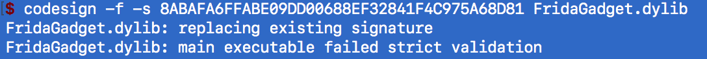

### 3. "Unable to locate DeviceSupport directory"


> 如果执行 ios-deploy 时，输出一下信息：
> 
> ```shell
> Unable to locate DeviceSupport directory. This probably means you don't have Xcode installed, you will need to launch the app manually and logging output will not be shown!
> ```
> 
> 则说明运行失败，原因可能是 XCode 没有设备支持的相关文件。
>
> **解决方法**: 例如：查看 iOS 设备的系统版本，发现是10.3.2 (14F89)，而目录 `/Applications/Xcode.app/Contents/Developer/Platforms/iPhoneOS.platform/DeviceSupport` 中只有支持到10.3.1 (14E8301)的版本。 
>   
> 可以通过以下方法使用10.3.1来启动10.3.2的设备。
> 
> ```shell
> $ sudo ln -s /Applications/Xcode.app/Contents/Developer/Platforms/iPhoneOS.platform/DeviceSupport/10.3.1\ \(14E8301\) /Applications/Xcode.app/Contents/Developer/Platforms/iPhoneOS.platform/DeviceSupport/10.3
> ```
> 
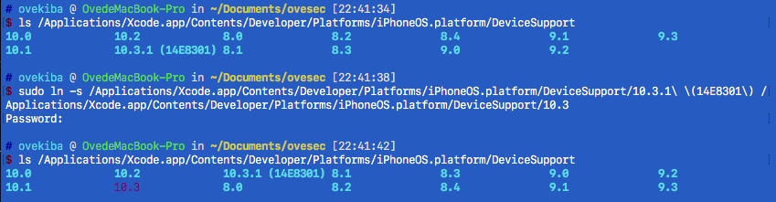

### 4 运行闪退

> 检查以下几项：   
> 
> a.　是否砸壳。   
> b.　所有 `Extension` 是否已重签。    `codesign -f -s xxxx`    
> c.　所有动态库是否已重签。          `codesign -f -s xxxx`     
> d.　Bundle ID 是否匹配。       

